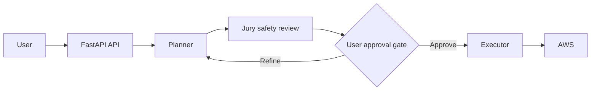

# AWS Automation Agent

A safety-first API agent that plans AWS changes, reviews their risk, waits for approval, and only then executes them.

## Architecture



The workflow has two distinct phases:

1. **Plan:** The planner converts a request into structured AWS tool calls. The Jury reviews the plan, and the API returns it without changing AWS resources.
2. **Approve and execute:** The user explicitly approves the stored plan. The executor retrieves the session's AWS credentials and runs the approved steps.

## Prerequisites

- Python 3.11 or newer
- An Anthropic API key
- A Gemini or Grok API key for the currently configured planner and Jury providers
- AWS credentials with permissions for the operations you request
- Redis (optional, for sessions that survive application restarts)

## Setup

```bash
git clone <repository-url>
cd aws-automation-tool
python -m venv .venv
```

Activate the virtual environment:

```bash
# macOS/Linux
source .venv/bin/activate

# Windows PowerShell
.venv\Scripts\Activate.ps1
```

Install dependencies and create the local environment file:

```bash
pip install -r requirements.txt
cp .env.example .env
```

On Windows PowerShell, use `Copy-Item .env.example .env` instead of `cp` if preferred. Fill `.env` with the required API keys and choose the planner, Jury, and session-store settings.

To use Redis, set `SESSION_STORE_BACKEND=redis` and provide a working `REDIS_URL`. The default is `SESSION_STORE_BACKEND=memory`.

## Run

From the project root:

```bash
uvicorn backend.app.main:app --reload
```

The API is available at `http://127.0.0.1:8000`. FastAPI's interactive documentation is at `http://127.0.0.1:8000/docs`.

## Frontend

Open frontend/index.html in your browser while the backend is running.

## API Usage

### 1. Create a reviewed plan

Send a request to `POST /api/v1/chat`. AWS credentials are stored in the selected session backend and injected only during execution.

```bash
curl -X POST "http://127.0.0.1:8000/api/v1/chat" \
  -H "Content-Type: application/json" \
  -d '{
    "message": "List my S3 buckets",
    "aws_access_key_id": "YOUR_AWS_ACCESS_KEY_ID",
    "aws_secret_access_key": "YOUR_AWS_SECRET_ACCESS_KEY",
    "region": "us-east-1"
  }'
```

The response includes a generated `session_id`, the structured `plan`, the `jury_verdict`, and a human-readable `formatted_plan`. Keep the session ID for approval.

### 2. Approve and execute the plan

Send the returned session ID to `POST /api/v1/approve`:

```bash
curl -X POST "http://127.0.0.1:8000/api/v1/approve" \
  -H "Content-Type: application/json" \
  -d '{
    "session_id": "SESSION_ID_FROM_CHAT",
    "approved": true
  }'
```

The response contains the execution `results` and a summary. To revise instead of execute, send `"approved": false` with a `refinement_message`.

## Why Plan Then Approve?

AWS operations can be expensive, destructive, or difficult to reverse. Separating planning from execution provides:

- **Safety:** No AWS tool runs during the planning phase.
- **Auditability:** The proposed steps and Jury verdict are visible before execution.
- **User trust:** The user retains the final decision over changes to their account.

## Jury System

The Jury is an independent safety review between planning and approval. It checks:

- Destructive keywords and known high-risk tool patterns
- The number of distinct tools and likely blast radius
- Destructiveness, reversibility, and blast radius through a separate LLM assessment
- Whether a plan requires explicit approval and which warnings should be shown

The Jury does not replace AWS IAM controls. Use least-privilege credentials and review every plan before approving it.

## Known Limitations

- With the default in-memory session store, sessions reset whenever the process restarts.
- Redis persists API session data, while LangGraph checkpoints currently remain process-local.
- Supported operations are limited to the tools registered in `backend/app/services/aws_tools.py`.

## Contributing

1. Create a branch for the change.
2. Keep behavior changes focused and add or update tests.
3. Run `pytest` from the project root.
4. Open a pull request describing the change, its safety impact, and how it was verified.

Never commit `.env`, AWS credentials, or live provider API keys.
