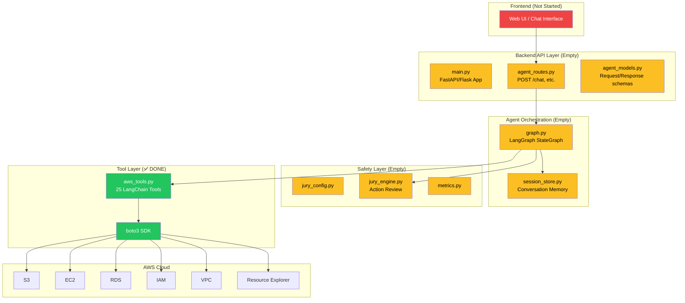

# 🚀 AWS Automation Tool — Handoff Document

> **Date:** June 8, 2026
> **Project:** `aws-automation-tool`
> **Status:** Early stage — core tool layer implemented, orchestration & API layers pending

---

## 1. What Is This Project?

This is an **AI-powered AWS infrastructure automation tool**. The goal is to let users describe what they want in natural language (e.g., *"Create a MySQL RDS instance named mydb"* or *"Launch a Windows EC2 instance"*) and have an **LLM agent** figure out which AWS API calls to make, gather the right parameters, and execute them — all without the user needing to touch the AWS console or write CloudFormation/Terraform.

### The Core Idea

```
User (natural language) → LLM Agent → AWS Tool Functions → boto3 → AWS APIs
```

The system is designed as a **LangChain tool-calling agent** where:
- The LLM receives a library of **tools** (Python functions) it can call
- Each tool has a **Pydantic schema** describing its inputs so the LLM knows exactly what parameters to provide
- The tools use **boto3** (the AWS SDK for Python) to make real AWS API calls
- AWS credentials are passed per-request (not stored server-side), making it multi-tenant safe

---

## 2. Project Structure

```
aws-automation-tool/
├── README.md                          # ⚠️ Empty
├── backend/
│   ├── README.md                      # ⚠️ Empty
│   └── app/
│       ├── main.py                    # ⚠️ Empty — FastAPI/Flask entry point (TBD)
│       ├── models/
│       │   └── agent_models.py        # ⚠️ Empty — request/response API models (TBD)
│       ├── routes/
│       │   └── agent_routes.py        # ⚠️ Empty — API route definitions (TBD)
│       ├── services/
│       │   ├── aws_tools.py           # ✅ IMPLEMENTED (1,475 lines) — The core of the project
│       │   ├── graph.py               # ⚠️ Empty — LangGraph agent orchestration (TBD)
│       │   ├── session_store.py       # ⚠️ Empty — conversation session management (TBD)
│       │   └── jury/
│       │       ├── jury_config.py     # ⚠️ Empty — evaluation system config (TBD)
│       │       ├── jury_engine.py     # ⚠️ Empty — evaluation/safety engine (TBD)
│       │       └── metrics.py         # ⚠️ Empty — evaluation metrics (TBD)
│       └── utils/
│           └── logging_decorator.py   # ⚠️ Empty — logging utility (TBD)
```

> [!IMPORTANT]
> **Only `aws_tools.py` has actual code.** All other files are empty scaffolds defining the intended architecture. The project structure tells us the *planned* system design, but only the tool layer is built.

---

## 3. What Has Been Built — `aws_tools.py` Deep Dive

This is the **only implemented file** and it's substantial at **1,475 lines / 61 KB**. It contains:

### 3.1 Overview

| Component | Count | Purpose |
|---|---|---|
| Pydantic Input Schemas | ~30 | Validate & describe tool parameters for the LLM |
| Pydantic Output Schemas | ~15 | Structure return data |
| LangChain `@tool` Functions | 25 | Executable AWS operations |
| Helper Functions | 6 | Internal utilities (AMI lookup, SG creation, etc.) |

### 3.2 AWS Services Covered

The tools span **6 major AWS services**:

#### 📦 S3 (Simple Storage Service) — 11 tools
| Tool Function | What It Does |
|---|---|
| `list_s3_buckets` | Lists all S3 bucket names in the account |
| `get_bucket_region` | Gets which region a specific bucket lives in |
| `create_s3_bucket` | Creates a new S3 bucket in a specified region |
| `delete_s3_bucket` | Deletes an S3 bucket |
| `set_s3_bucket_policy` | Sets bucket access policy (private / public-read / custom JSON) |
| `enable_s3_versioning` | Enables or suspends object versioning |
| `set_s3_bucket_encryption` | Configures server-side encryption (AES-256 or KMS) |
| `configure_s3_object_lock` | Enables WORM-style object lock (GOVERNANCE or COMPLIANCE mode) |
| `configure_lifecycle_rule` | Sets lifecycle transition rules (e.g., move to Glacier after N days) |
| `configure_bucket_logging` | Enables/disables access logging to a target bucket |
| `configure_bucket_replication` | Sets up cross-region bucket replication |
| `configure_bucket_event_notification` | Triggers Lambda on S3 events (object created/deleted) |

#### 🖥️ EC2 (Elastic Compute Cloud) — 2 tools + 3 helpers
| Tool Function | What It Does |
|---|---|
| `create_ec2_instance` | Full instance launch: AMI lookup, KeyPair, Security Group, EBS, network |
| `delete_ec2_instance` | Terminates an instance by its Name tag |

**Helper functions** (not exposed as tools, used internally):
- `get_ami_id()` — Resolves a friendly name like `"Windows_Server 2019"` to the latest official Amazon AMI ID
- `create_default_security_group()` — Creates an "AutoSG" security group with SSH/RDP + HTTP/HTTPS rules based on OS type
- `get_device_name()` — Returns the correct root volume device name based on OS type
- `get_instance_id_by_name()` — Looks up instance ID from a Name tag

#### 🗄️ RDS (Relational Database Service) — 2 tools
| Tool Function | What It Does |
|---|---|
| `create_rds_instance` | Launches MySQL/Postgres/Oracle/SQL Server instance |
| `delete_rds_instance` | Deletes an RDS instance (with optional final snapshot) |

#### 👤 IAM (Identity & Access Management) — 7 tools
| Tool Function | What It Does |
|---|---|
| `create_iam_user` | Creates a new IAM user |
| `delete_iam_user` | Deletes an IAM user |
| `attach_policy_to_user` | Attaches a managed IAM policy to a user |
| `detach_policy_from_user` | Removes a policy from a user |
| `create_custom_policy` | Creates a new custom IAM policy from a JSON document |
| `create_access_key_for_user` | Generates new Access Key + Secret Key for a user |
| `rotate_access_key` | Creates new key, deactivates old key |
| `attach_instance_profile_to_ec2` | Attaches an IAM role (via instance profile) to a running EC2 instance |

#### 🌐 VPC (Virtual Private Cloud) — 3 tools + 3 helpers
| Tool Function | What It Does |
|---|---|
| `get_vpc_details` | Lists all VPCs with their IDs, names, and CIDR blocks |
| `create_vpc` | Full VPC setup: creates VPC + Subnet + Internet Gateway + Route Table + Security Group |
| `delete_vpc` | Cleans up all VPC dependencies and deletes the VPC |

**Helper functions:**
- `create_and_attach_igw()` — Creates and attaches an Internet Gateway
- `create_public_route_table()` — Creates a route table with a 0.0.0.0/0 route through IGW
- `create_web_security_group()` — Creates a security group with HTTP/HTTPS/SSH ingress
- `cleanup_vpc_dependencies()` — Deletes all SGs, Subnets, IGWs before VPC deletion

#### 🔍 Resource Explorer — 1 tool
| Tool Function | What It Does |
|---|---|
| `list_resources_in_region` | Uses AWS Resource Explorer v2 to list all resource ARNs in a region |

### 3.3 Tool Registration

All tools are collected via `get_all_aws_tools()` (line 371–399), which returns a list of 25 tool function references. This list is what gets passed to the LangChain agent so it knows what tools are available.

```python
def get_all_aws_tools():
    return [
        list_s3_buckets, get_bucket_region, set_s3_bucket_policy,
        enable_s3_versioning, set_s3_bucket_encryption,
        configure_lifecycle_rule, configure_bucket_logging,
        configure_bucket_replication, configure_bucket_event_notification,
        create_s3_bucket, delete_s3_bucket,
        create_iam_user, attach_policy_to_user, create_custom_policy,
        detach_policy_from_user, create_access_key_for_user,
        rotate_access_key, delete_iam_user, attach_instance_profile_to_ec2,
        create_rds_instance, delete_rds_instance,
        create_ec2_instance, get_vpc_details, create_vpc, delete_vpc,
    ]
```

### 3.4 How Each Tool Works (Pattern)

Every tool follows this consistent pattern:

```python
# 1. Pydantic schema defines and validates inputs
class CreateBucketInput(BaseModel):
    aws_access_key_id: str = Field(...)
    aws_secret_access_key: str = Field(...)
    bucket_name: str = Field(...)
    region: str = Field(...)

# 2. LangChain @tool decorator registers it as callable by the agent
@tool(args_schema=CreateBucketInput, return_direct=True)
def create_s3_bucket(aws_access_key_id, aws_secret_access_key, bucket_name, region):
    """Docstring = what the LLM reads to decide when to use this tool."""
    
    # 3. boto3 client created per-call with user's credentials
    s3_client = boto3.client("s3",
        aws_access_key_id=aws_access_key_id,
        aws_secret_access_key=aws_secret_access_key,
        region_name=region
    )
    
    # 4. Actual AWS API call
    try:
        s3_client.create_bucket(Bucket=bucket_name, ...)
        return CreateBucketOutput(status="Bucket created successfully.", ...)
    except Exception as e:
        return CreateBucketOutput(status=f"Error: {str(e)}", ...)
```

> [!NOTE]
> **Key design decisions in this pattern:**
> - **`return_direct=True`** — Most tools use this, meaning the tool's output goes directly to the user without the LLM rephrasing it. A few tools (like `create_access_key_for_user`, `create_custom_policy`, `attach_instance_profile_to_ec2`) do NOT set this, allowing the LLM to process/format the result.
> - **Credentials per-call** — AWS keys are parameters on every tool (not env vars), enabling multi-user/multi-account usage.
> - **Region hardcoded** — EC2, RDS, and VPC tools currently hardcode `region_name="ap-south-1"`. S3 tools are region-flexible.

---

## 4. Key Technology Stack

| Technology | Role |
|---|---|
| **Python** | Core language |
| **boto3** | AWS SDK — every tool uses it to call AWS APIs |
| **LangChain** (`langchain_core.tools`) | The `@tool` decorator registers functions as agent-callable tools |
| **Pydantic** (`pydantic.BaseModel`) | Input/output validation and schema generation for tools |
| **python-dotenv** | Environment variable loading (`.env` file) |
| **LangGraph** *(planned)* | Agent orchestration graph (file exists but empty) |

---

## 5. Credential Handling

> [!WARNING]
> AWS credentials are passed as **function parameters** on every single tool call. This is by design for multi-tenancy, but it means:
> - The LLM agent must know the user's `AWS_ACCESS_KEY_ID` and `SECRET_KEY_ACCESS` to call any tool
> - These credentials flow through the LLM context window
> - There is **no credential storage or encryption layer** currently implemented

There are two naming conventions used (inconsistently):
- S3 and IAM tools use: `aws_access_key_id` / `aws_secret_access_key`
- EC2, RDS, and VPC tools use: `AWS_ACCESS_KEY_ID` / `SECRET_KEY_ACCESS`

---

## 6. What Is NOT Built Yet (Empty Files)

### `main.py` — Application Entry Point
**Purpose:** This would be the FastAPI or Flask application that starts the HTTP server and registers routes. Currently empty.

### `agent_models.py` — API Request/Response Models
**Purpose:** Pydantic models for the HTTP API layer (e.g., `ChatRequest`, `ChatResponse`). Not the same as the tool schemas in `aws_tools.py`. Currently empty.

### `agent_routes.py` — HTTP Routes
**Purpose:** The REST API endpoints that a frontend would call (e.g., `POST /chat`, `GET /session/{id}`). Currently empty.

### `graph.py` — LangGraph Agent Orchestration
**Purpose:** This is where the LangGraph `StateGraph` would be defined — the agent's decision loop:
1. Receive user message
2. LLM decides which tool(s) to call
3. Execute tool(s)
4. LLM processes results
5. Either call more tools or return final answer

Currently empty. **This is the most critical missing piece** — without it, the tools exist but nothing invokes them.

### `session_store.py` — Session Management
**Purpose:** Stores conversation history per user session so the agent has context across multiple messages. Currently empty.

### `jury/` — Evaluation & Safety System
A subsystem with 3 empty files:
- **`jury_config.py`** — Configuration for the evaluation system
- **`jury_engine.py`** — The engine that evaluates agent actions (likely a "judge" LLM that reviews planned actions before execution)
- **`metrics.py`** — Metrics tracking for the evaluation system

**Likely intent:** A safety layer where a second LLM reviews the agent's planned AWS actions before they execute (e.g., "Are you sure you want to delete this VPC? It has running instances.").

### `logging_decorator.py` — Logging Utility
**Purpose:** A decorator or utility for structured logging. The code in `aws_tools.py` has commented-out `# logger.error(...)` calls referencing this module, confirming it was planned but not yet implemented.

---

## 7. Architecture Diagram (Intended)



**Legend:** 🟢 Green = Done | 🟡 Yellow = Scaffolded (empty) | 🔴 Red = Not started

---

## 8. Current Completion Status

| Layer | Status | Details |
|---|---|---|
| **AWS Tool Functions** | ✅ Complete | 25 tools across 6 services, fully functional |
| **Pydantic Schemas** | ✅ Complete | ~45 input/output models defined |
| **Agent Orchestration** | ❌ Not started | `graph.py` is empty — no LangGraph flow |
| **API Layer** | ❌ Not started | `main.py`, `agent_routes.py`, `agent_models.py` all empty |
| **Session Management** | ❌ Not started | `session_store.py` is empty |
| **Safety/Jury System** | ❌ Not started | All 3 jury files are empty |
| **Logging** | ❌ Not started | `logging_decorator.py` is empty; logger calls are commented out |
| **Frontend** | ❌ Not started | No frontend directory exists |
| **Tests** | ❌ Not started | No test files exist |
| **Configuration** | ❌ Not started | No `requirements.txt`, `pyproject.toml`, or `.env.example` |

---

## 9. Known Issues & Technical Debt

> [!WARNING]
> ### Issues to address before production:

1. **Hardcoded region** — EC2, RDS, VPC tools hardcode `region_name="ap-south-1"`. Should be parameterized.

2. **Inconsistent credential naming** — S3/IAM use `aws_access_key_id` / `aws_secret_access_key` while EC2/RDS/VPC use `AWS_ACCESS_KEY_ID` / `SECRET_KEY_ACCESS`. This will confuse the LLM agent.

3. **Missing `list_resources_in_region` in tool registry** — The function exists but is NOT included in `get_all_aws_tools()` return list.

4. **Commented-out logger** — `logger.error()` calls exist but are commented out because `logging_decorator.py` is empty. Two `create_access_key_for_user` error handlers still reference `logger` (uncommented) which would cause a `NameError` at runtime.

5. **`return_direct=True` inconsistency** — Most tools set this, some don't. This affects how the agent processes results and should be made consistent.

6. **No error standardization** — Some tools return Pydantic output models on error, others return raw strings with emoji prefixes (`❌ Error:`). The agent needs a consistent error format.

7. **No input sanitization** — Tool inputs go straight to boto3 without additional validation beyond Pydantic type checking.

8. **KeyPair PEM files written to working directory** — `create_ec2_instance` writes `.pem` files to the current directory and calls `os.chmod` (which may fail on Windows).

---

## 10. What Needs to Be Done Next (Priority Order)

### Priority 1 — Make it runnable
1. **Create `requirements.txt`** — Pin dependencies: `boto3`, `langchain`, `langchain-core`, `langgraph`, `pydantic`, `python-dotenv`, `fastapi`/`flask`, `uvicorn`
2. **Implement `graph.py`** — Build the LangGraph `StateGraph` with a tool-calling ReAct loop
3. **Implement `main.py`** — FastAPI app with at least one endpoint to test the agent

### Priority 2 — Core functionality
4. **Implement `session_store.py`** — In-memory or Redis-backed conversation history
5. **Implement `agent_routes.py`** — `POST /chat` endpoint accepting user message + AWS creds
6. **Implement `agent_models.py`** — API-level request/response Pydantic models
7. **Fix credential naming inconsistency** across all tools

### Priority 3 — Safety & quality
8. **Implement the Jury system** — LLM-based action review before destructive operations
9. **Implement `logging_decorator.py`** — Structured logging for debugging and audit
10. **Add tests** — Unit tests for tools (mocked boto3), integration tests for the graph

### Priority 4 — Production readiness
11. **Add a frontend** (React/Next.js chat UI)
12. **Secure credential handling** (don't pass through LLM context)
13. **Make region configurable** on all tools
14. **Add rate limiting and error retry logic**

---

## 11. How to Use the Tools Directly (For Testing)

Even without the agent layer, you can test individual tools:

```python
from backend.app.services.aws_tools import list_s3_buckets, create_s3_bucket

# List all buckets
buckets = list_s3_buckets.invoke({
    "aws_access_key_id": "AKIA...",
    "aws_secret_access_key": "your-secret-key"
})
print(buckets)

# Create a bucket
result = create_s3_bucket.invoke({
    "aws_access_key_id": "AKIA...",
    "aws_secret_access_key": "your-secret-key",
    "bucket_name": "my-test-bucket-12345",
    "region": "us-east-1"
})
print(result)
```

---

## 12. Contributors / Attribution

The code contains a comment `# Tayyab` (line 1010) before the EC2/RDS/VPC sections, suggesting at least two contributors:
- **Unknown** — S3 and IAM tool sections
- **Tayyab** — EC2, RDS, VPC tool sections

---

> [!TIP]
> **Bottom line:** The project has a solid tool layer (the hardest part of AWS integration) but needs the agent brain (`graph.py`), the API shell (`main.py` + routes), and the safety net (`jury/`) to become a working product. The architecture is well-planned — it just needs execution on the remaining layers.
